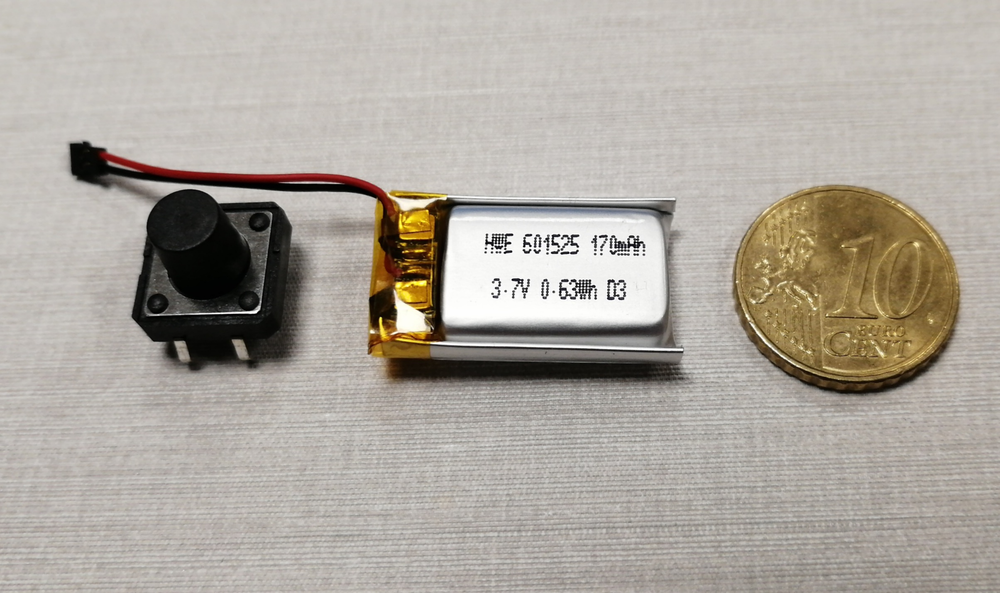
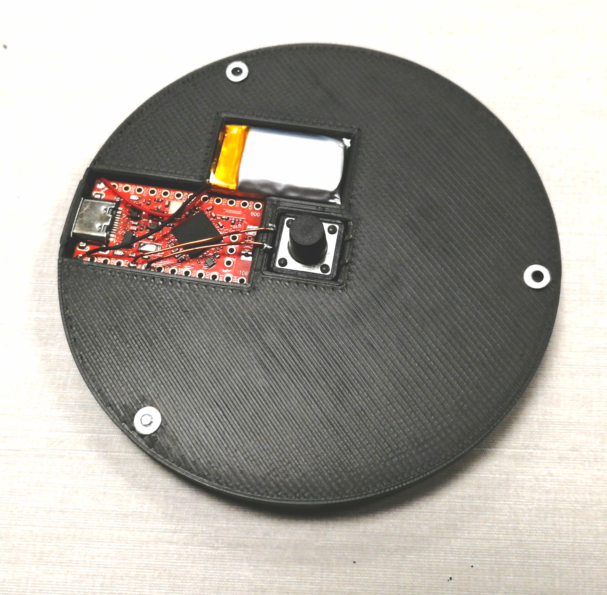
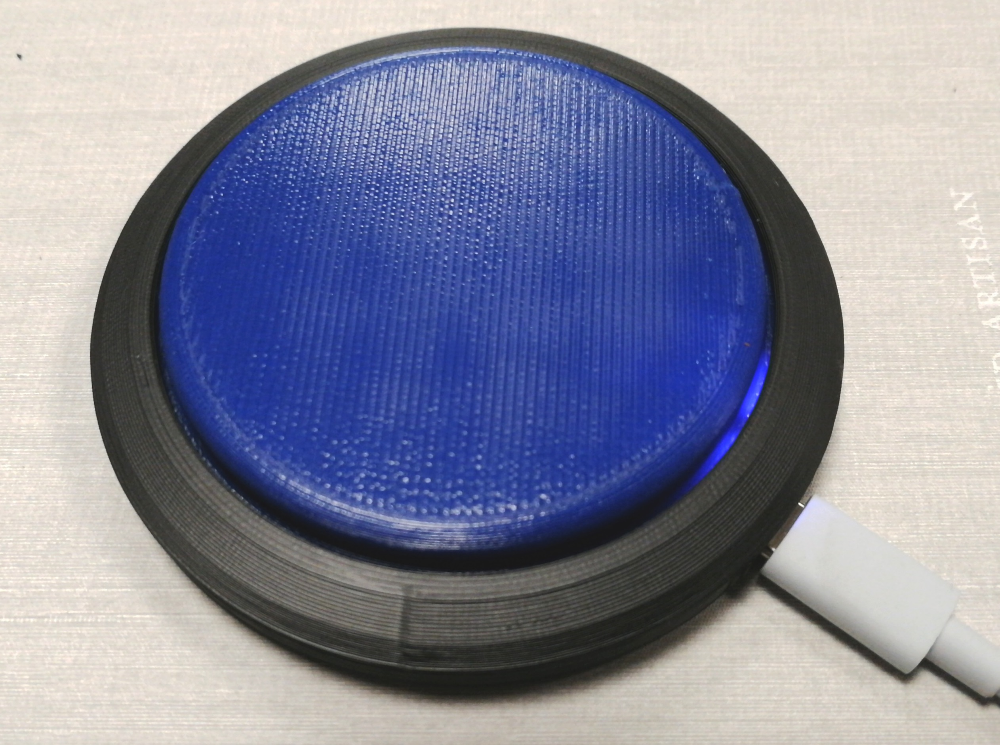

# Bleeny: an nRF52840-based low cost BLE Button

The Bleeny Button is an assistive switch for creating a key press or other HID activities using Bluetooth Low Energy (BLE). It can be used to control SmartPhones, Tablets, Computers or AAC Software like our free and open source [Asterics AAC](https://aac.asterics.eu). The Bleeny Button utilizes the affordable Tenstar Robot devboard (aka nice!nano) or a XIAO nRF52840 board with the Nordic nrf52840 microcontroller. A good summary of the features of this SoC/board is provided at the [Zephyr documentation page](https://docs.zephyrproject.org/latest/boards/others/promicro_nrf52840/doc/index.html). The source code builds with PlatformIO, using the Adafruit nRF52 and Bluefruit libraries. The code is based upon the [BLE keyboard example](https://github.com/adafruit/Adafruit_nRF52_Arduino/blob/master/libraries/Bluefruit52Lib/examples/Peripheral/blehid_keyboard/blehid_keyboard.ino)

## Requirements

* install VSCode/PlatformIO and build a project for the Adafruit Feather nRF52840 Express (or a similar Adafruit nRF board, to install the nRF platform packages) 
* add the files for the nice nano board as described here: [Nicenano-NRF52-Supermini-PlatformIO-Support](https://github.com/ICantMakeThings/Nicenano-NRF52-Supermini-PlatformIO-Support) (not necessary for the XIAO board)

## Usage

* build and upload the demo code (note that the Serial USB CDC interface must be enabled in the code in order to use the auto-upload via DFU in PlatformIO)
* pair the BLE device (e.g. Bleeny-214D, the unique number is composed from the mac address of your device) 
* attach a pushbuttons to GPIO pin 017 and GND (optionally, more buttons can be connected to pins 020, 022, 024 and 100) 
* when pressed, the buttons shall trigger keys (default settings are: `SPACE` , `ENTER`, `1`, `2` and `3`)
* changing settings can be done with the simple config UI (or a serial terminal): __ui/config.html__ or [online](https://assistronik.info/config.html)

### Notes regarding low power operation / current consumption

In paired active mode, current consumption is about 1.2mA @ 3,3V (which can reduced to ~1mA if the activity LED is not used).  
After an adjustable time of user inactivity (constant `SLEEP_TIMEOUT_MS`), the nRF enters hibernation / deep sleep where current consumption drops to 
~1,4uA @ 3,7V. (For this, the LDO for providing external VCC must be disabled, else around 40uA are consumed). This could be further improved by supplying power directly to the VDD pin on the backside of the PCB, see [this post in the Arduino forum](https://forum.arduino.cc/t/nrf52840-development-board-with-adafruit-nrf52-core/1290505/6)
A wakeup can be triggered by pressing any of the configured buttons. This will cause a system reset. BLE connection to a paired host is usually re-established in 1-3 seconds. 

## Suggested hardware setup

### 3D printed parts

You need to print following files from the `hw` folder:

* _0-1-ProMicro_Basic.stl_ (Tenstar Board, one button) __OR__ _0-2-ProMicro_Output.stl_ (Tenstar Board, button + output jack plug with a relay __OR__ _0-3-XIAO_Basic.stl_ (XIAO nRF52840 Board, one button) __OR__ _0-3-XIAO_Output.stl_ + _0-3-XIAO_Output_Clip.stl_ (XIAO nRF52840 board, button + output jack plug with a relay)
* _1-Ring.stl_
* _2-Topper.stl_

### Electronic / mechanical parts

* Tenstar nRF52840 Pro Micro (nice!nano) __OR__ [XIAO nRF52840](https://www.tme.eu/at/en/details/seeed-102010448/development-kits-for-data-transmission/seeed-studio/xiao-nrf52840/)
* [Tactile push button 12x12mm, 8.5mm height](https://www.tme.eu/at/en/details/tl3300cf160q/microswitches-tact/e-switch/)
* [170mA LiPo battery](https://www.pollin.de/p/lithium-polymer-akku-hwe601525-3-7-v-170-mah-5-stueck-273699)
* [3x M2x8mm screw](https://www.tme.eu/at/en/details/m2x8_d7985-a2/bolts/kraftberg/)

Optional (if using the BleenyButton with the output enabled):

* [FTR-B3GB003Z](https://www.tme.eu/at/en/details/ftr-b3gb003z/miniature-electromagnetic-relays/fcl-components/) mini relay, latching, 3V
* [FC68125](https://www.tme.eu/at/en/details/fc68125/jack-connectors/cliff/) 3.5mm jack

### Assembly

Please have a look at the pictures named __wiring_*__ in the folder `img`, select the correct picture for your setup (Tenstar or XIAO board, button only or with output)

1. Glue the parts into the case, either use hotglue or mounting adhesive (recommended!)

   Note 1: avoid glue in the USB-C connector and the jack plug (if mounted)

   Note 2: do not glue any contacts, soldering will result in hazardous fumes

2. Solder the button and optional relay/jackplug

   Note: avoid short circuits if using bare wire

   Note: also solder the shown bridges if using relay/jackplug

3. Solder the battery

   Note: avoid any short circuits with the battery! Especially when removing the plug or the insulation.

   Note: on the XIAO board, the LEDs will blink if the battery is connected correctly

4. Place the topper on the base, add the ring. Hold the ring & base and screw them together (M2x8 screws, 3x)

### Programming

* Open this folder with VSCodium (or VSCode if prefer M$ tracking)
* Select the correct target in PlatformIO:
  * XIAO nRF52840: `[env:xiao_nrf52840]`
  * Tenstar: first select `[env:adafruit_feather_nrf52840]`, build an example and the build with `[env:nicenano]`
* With relay/jackplug: enable `//#define OUTPUT_ACTIVE`
* Upload

   

 # Acknowledgement
This work has been accomplished at the UAS Technikum Wien in course of the R&D-project [InDiKo](https://www.technikum-wien.at/en/research-projects/indiko/) (MA23 project 38-09), which is supported by the [City of Vienna](https://www.wien.gv.at/kontakte/ma23/index.html).

FreeCAD project, output addition, XIAO board adaption and software bugfixes are done by Benjamin Aigner, [Assistronik](https://assistronik.info)
